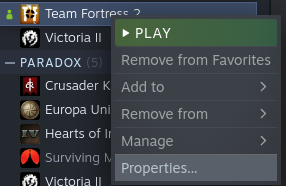
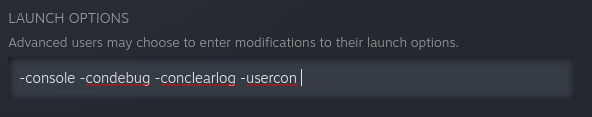

[](https://github.com/albarozzz/taunter-rs/actions/workflows/release.yml)

Taunter-rs provides a way of interacting to Team Fortress 2 without modifying core files as that would be illegal and you could be VAC banned, instead it uses RCON and the console log to communicate to TF2, a non-intended way of using RCON but legal as we don't modify anything.

# Instructions

To run this program you first need to go to your steam library, right click on tf2 and select "Properties..."



And add to launch parameters `-condebug -conclearlog -usercon`



Next, you'll need to modify your autoexec.cfg inside tf2rootfolder/tf/cfg/ to add these lines:

```
ip 0.0.0.0
con_timestamp 1
rcon_password "YOUR PASSWORD"
net_start
```

Then, you need to configure your config.json located in the executable's folder to target you or your friends or whoever you desire. Here's an example:

```json
{
    "rcon_password": "PASSWORD", // write your password set in autoexec.cfg
    "tf2_path": "... /steamapps/common/Team Fortress 2/", // your tf2 path
    "usernames": [
        "YOUR STEAM USERNAME",
        "YOUR FRIEND'S USERNAME" // delete this if you don't want to taunt when your friend kill
    ],
    "words": ["message1", "..."] // list of message(s) you want to send when any user in usernames kill someone, ONLY 1 MESSAGE WILL BE SENT RANDOMLY
}
```

You may add extra settings to adjust your gameplay like:


| Key             | Value           | Description                                                                                                                                                                                                         |
| :---------------- | ----------------- | :-------------------------------------------------------------------------------------------------------------------------------------------------------------------------------------------------------------------- |
| rcon_password   | string          | Password set in autoexec.cfg                                                                                                                                                                                        |
| tf2_path        | string          | Path to tf2 root folder may be absolute or relative                                                                                                                                                                 |
| usernames       | list of strings | When any of these usernames kills any enemy (or specified by username_victim) you'll taunt. You need to add yourself to this list if you want to taunt when killing                                                 |
| words           | list of strings | A random word will be picked and sent in chat when any user in usernames kill someone (or username_victim)                                                                                                          |
| port            | string          | Server's (and rcon's) port to connect to, default to "27015", DO NOT FORWARD THIS PORT.                                                                                                                             |
| username_victim | list of strings | You'll taunt only to these enemies if he was killed by any user in usernames, if this variable is not empty default to an empty list ([]).                                                                          |
| use_spinbot     | boolean         | Uses +left to spin for one second after any user in usernames kill someone (or username_victim), default to false, overrides taunting and you can customize its rotational speed with cl_yawspeed, default to false |
| use_soundpad    | boolean         | Only available in Windows, plays a sound when any user in usernames kill someone or username_victim, the sound used is in index 1, default to false                                                                 |
| use_taunt       | boolean         | When any of usernames kills any enemy (or specified by username_victim) you'll taunt. default to true except in CLI.                                                                                                |
| soundpad_path   | string          | Only available in Windows, Path to soundpad root folder, default to empty string                                                                                                                                    |
| extra_commands  | string          | Extra commands to send through rcon. Default to empty string.                                                                                                                                                       |

You'll need to put your favorite taunt to slot 1!

# Advanced behaviour

You can customize what to do depending on the enemy you've killed. 
Imagine this configuration:

```json
{
    "rcon_password": "PASSWORD",
    "tf2_path": "... /steamapps/common/Team Fortress 2/", // your tf2 path
    "usernames": [
        "YOUR STEAM USERNAME",
        "YOUR USERNAME" // delete this if you don't want to taunt when your friend kill
    ],
    "username_victim": ["albarozzz", "Victor"],
    "words": ["message1", "..."] // list of message(s) you want to send when any user in usernames kill someone, ONLY 1 MESSAGE WILL BE SENT RANDOMLY
}
```

For example, let's say you killed Victor who is in your username_victim list and you really hate that guy and, for that reason, you must show your superiority.
```json
{
    "when_killed_Victor_by_YOUR USERNAME": { // if THAT USERNAME from your usernames list kills Victor
        "use_taunt": true,
        "message_to_send": [
            "you're so bad"
        ],
        "extra_commands": "say ez; say ez; say ez"
    }
}
```
This would use a taunt, send a randomly picked message and 3 extra ezs independently of your config.json.
You can do something like this too if you want:
```json
{
    "when_killed_Victor": { // if ANYONE from your usernames list kills Victor
        "use_taunt": true,
        "message_to_send": [
            "you're so bad"
        ],
        "extra_commands": "say ez; say ez; say ez"
    }
}
```

You only need to create a file named "users.json" and pass the following argument:
`./taunter --user-victim-config PATH_TO_USERS.JSON ...`
Or:
`./taunter -U PATH_TO_USERS.JSON ...`

# Running/Using it as a CLI

With version 0.4.0 you can now use the taunter with a Command Line Interface.

Make sure to check it out using

`./taunter --help`

if you want to use a traditional config.json file you can use

`./taunter --config config.json`

# Building

Use cargo to build and install dependencies

`cargo build --release`
